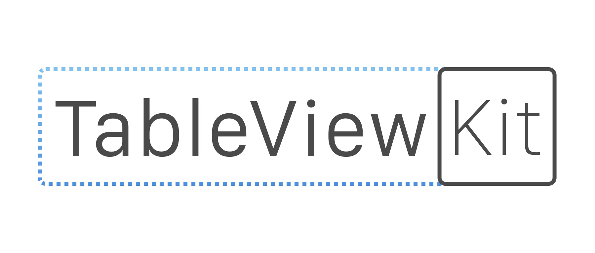

<p align="center">

</p>
<p align="center">
<a href="https://travis-ci.org/odigeoteam/TableViewKit"></a>
<a href="https://cocoapods.org/pods/TableViewKit"></a>
<a href="https://github.com/Carthage/Carthage"></a>
<br>
<a href="http://codecov.io/github/odigeoteam/TableViewKit"></a>
<a href="http://cocoadocs.org/docsets/TableViewKit"></a>
<a href="https://swift.org"></a>
<a href="https://tldrlegal.com/license/mit-license"></a>
</p>

Empowering `UITableView` with painless multi-type cell support and built-in automatic state transition animations

## Getting Started
- [Download TableViewKit](https://github.com/odigeoteam/TableViewKit/releases) and play with our [examples](https://github.com/odigeoteam/TableViewKit/tree/develop/Examples)
- First time with TableViewKit? Read the ["Overview"](#overview) section below

## Overview

TableViewKit is designed:
- to easily develop custom sections with different headers, footers and multiple cell types
- to support stateful sections
- to enforce reusability and testability
- and last but not least, to forget `UITableView`'s delegates

### Quickstart

Create an `TableItem` with a `UITableViewCell` and `CellDrawer`. An item may have a model of the data you want to display and may control the interaction if any.

```swift

class YourDrawer: CellDrawer {

    // The type could be a custom UITableViewCell class, with or without a Nib
    static var type = CellType.class(YourCustomCell.self)

    static func draw(_ cell: YourCustomCell, with item: YourItem) {
        // Draw by setting properties of your cell from the item
    }
}

class YourItem: TableItem {

    var drawer = AnyCellDrawer(YourDrawer.self)

    // Your properties and methods

    public init() { }
}
```

Create a custom `TableSection` with your items.

```swift
class YourSection: TableSection {
    var items: ObservableArray<TableItem>

    var header: HeaderFooterView = .title("Your section")

    public init() {
      items = [YourItem(), AnotherItem(), AndAnotherItem()]
    }
}
```

Ready to go, instantiate a `TableViewManager`, in your `UIViewController` with a `UITableView` and the array of custom sections

```swift
class ViewController: UIViewController {
    var tableViewManager: TableViewManager!

    @IBOutlet weak var tableView: UITableView! {
        didSet {
            tableViewManager = TableViewManager(tableView: tableView, sections: [CustomSection])
        }
    }
}
```

## Examples

## Requirements
- Xcode 8 or higher
- iOS 8.0 or higher

## Installation

#### CocoaPods
You can use [CocoaPods](http://cocoapods.org/) to install `TableViewKit` by adding it to your `Podfile`:

```ruby
platform :ios, '8.0'
use_frameworks!
pod 'TableViewKit'
```

To get the full benefits import `TableViewKit` wherever you import UIKit

``` swift
import UIKit
import TableViewKit
```

#### Carthage
Create a `Cartfile` that lists the framework and run `carthage bootstrap`. Follow the [instructions](https://github.com/Carthage/Carthage#if-youre-building-for-ios) to add `$(SRCROOT)/Carthage/Build/iOS/TableViewKit.framework` to an iOS project.

```
github "odigeoteam/TableViewKit"
```

#### Manually
1. Download and drop ```/TableViewKit``` folder in your project.  
2. Congratulations!  

## Communication

- If you **found a bug**, open an issue.
- If you **have a feature request**, open an issue.
- If you **want to contribute**, submit a pull request.
